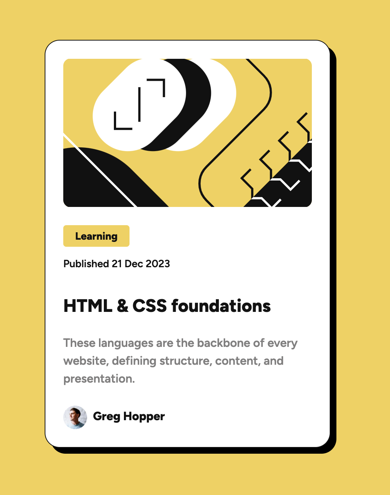

# Frontend Mentor - Blog preview card solution

This is a solution to the [Blog preview card challenge on Frontend Mentor](https://www.frontendmentor.io/challenges/blog-preview-card-ckPaj01IcS). Frontend Mentor challenges help you improve your coding skills by building realistic projects. 

## Table of contents

- [Overview](#overview)
  - [Screenshot](#screenshot)
  - [Links](#links)
- [My process](#my-process)
  - [Built with](#built-with)
- [Author](#author)

## Overview

### Screenshot

### Links

- Solution URL: [GitHUb repo](https://github.com/eclectic-coding/fem-blog-card-preview)
- Live Site URL: [Live site URL](https://fem-blog-card-preview.vercel.app/)

## My process

### Built with

- Semantic HTML5 markup
- Flexbox
- CSS Grid
- [VueJS](https://vuejs.org/) - JS library
- [Bootstrap](https://getbootstrap.com/) - For styles along with scoped CSS

## Author

- Website - [Chuck Smith](https://eclecticcoding.com)
- Frontend Mentor - [@eclectic-coding](https://www.frontendmentor.io/profile/eclectic-coding)
- Twitter - [@EclecticCoding](https://twitter.com/EclecticCoding)
- LinkedIn - [Chuck Smith](https://www.linkedin.com/in/dev-chuck-smith/)
